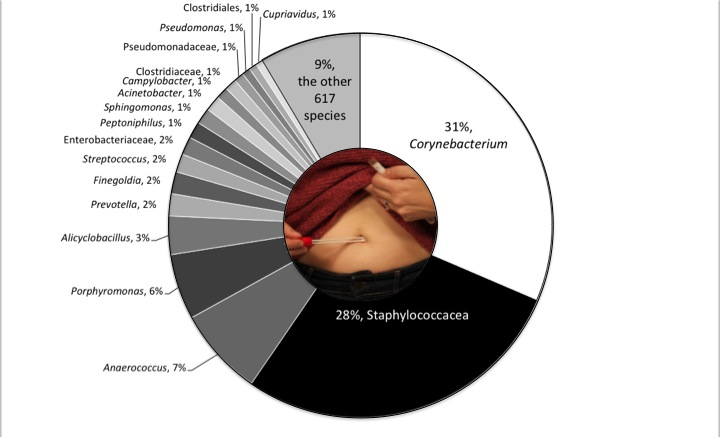

# belly-button-challenge

***An interactive adventure through various belly buttons, their jungle of microbial diversity, and weekly washing frequencies!***  

Please enjoy this mighty javascript visualization celebrating the 2300 species of bacteria detected in 60 navels! 

 

P.S. Don't forget to wash!

REFERENCES
- Chatgpt used to improve logic, error correction and generate sections of code.
- Google to get syntax for adapting to my code.
- JSON Data Used <a href='https://static.bc-edx.com/data/dl-1-2/m14/lms/starter/samples.json'>samples.json</a> 
- Citing the original inspiration <a href='https://robdunnlab.com/projects/belly-button-biodiversity/results-and-data/'>NC - The Public Science Lab</a> 
